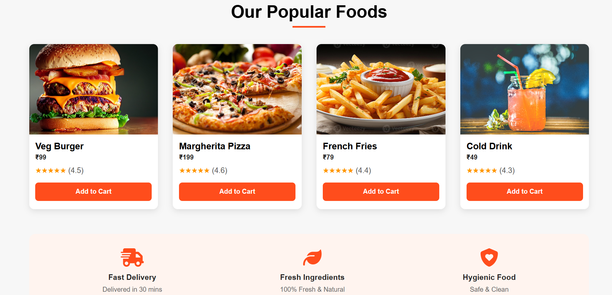

# Responsive Web Page

A simple and clean **responsive web page** created to demonstrate responsive web design using only **HTML and CSS**.

## 🌐 About the Project

This project is a basic responsive website designed to adapt to different screen sizes.

The main purpose of this project is to practice and demonstrate how **HTML and CSS** can be used to create a responsive layout for desktop, tablet, and mobile devices.

## 🛠️ Technologies Used

* HTML5
* CSS3

## ✨ Features

* Responsive layout
* Mobile-friendly design
* Responsive navigation
* Flexible images and content
* CSS media queries
* Clean and simple design
* Works on desktop, tablet, and mobile screens

## 📱 Responsive Design

The webpage is designed to automatically adjust according to the screen size.

It supports:

* 🖥️ Desktop
* 💻 Laptop
* 📱 Mobile
* 📲 Tablet

## 📸 Screenshot

# Desktop

## 🎯 Purpose

This project is created **only to demonstrate responsive web design**.

It contains only:

* HTML
* CSS
## 🚀 How to Run

1. Download or clone this repository.
2. Open the project folder.
3. Open `index.html` in a web browser.
4. Resize the browser window to see the responsive design.
